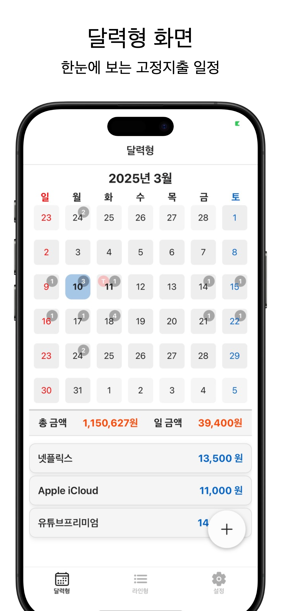
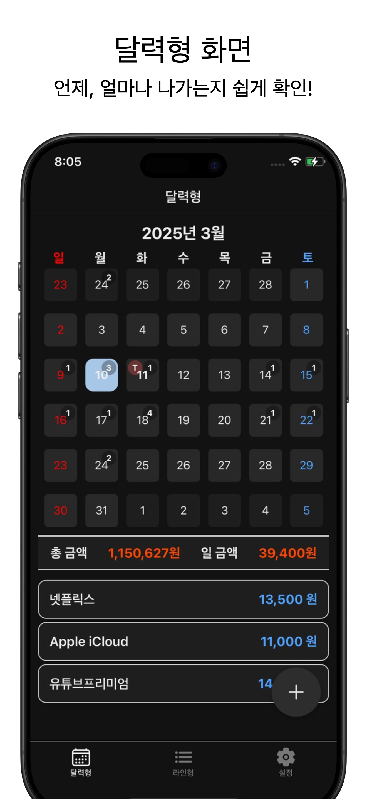
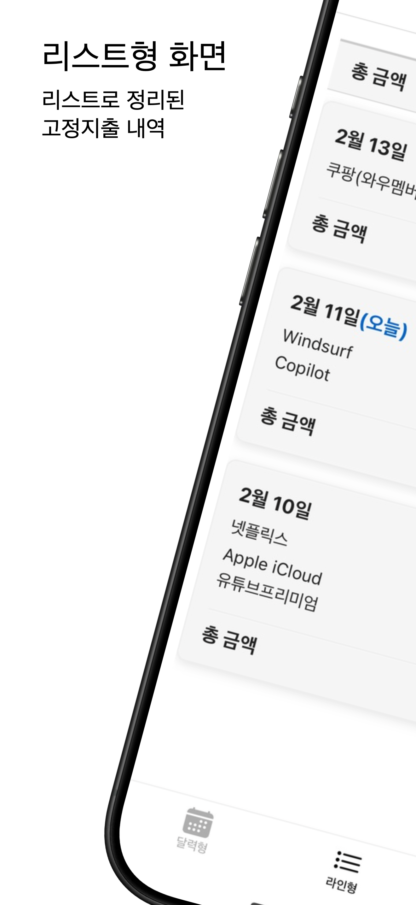
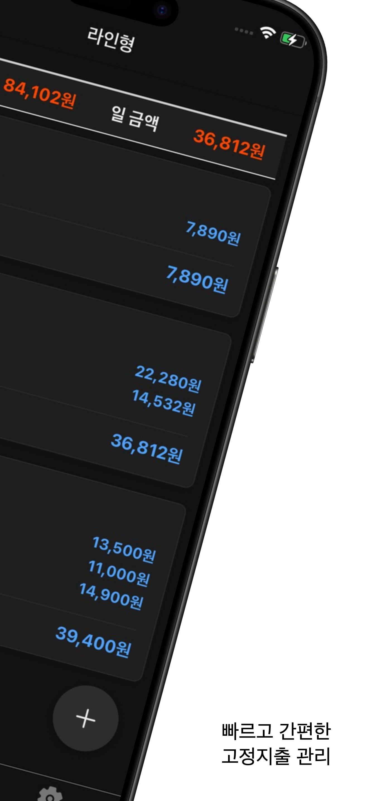
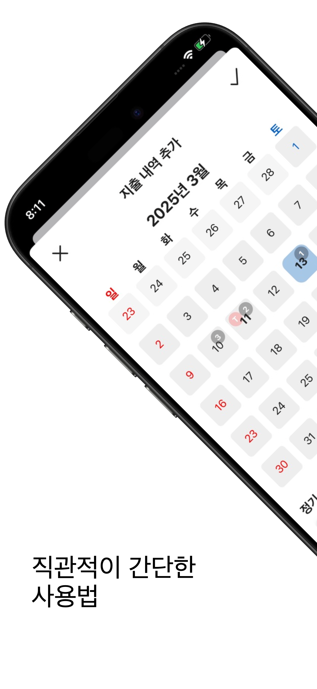
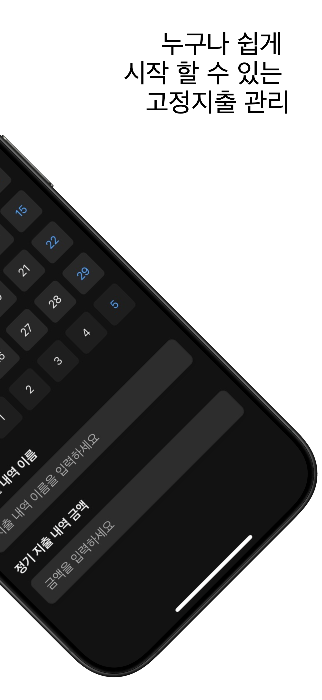

# 고정지출달력 📅💰

### 매월 반복되는 지출을 쉽고 직관적으로 관리할 수 있는 iOS 앱입니다. 복잡한 기능 없이 필요한 것만 담았습니다.

### 달력 & 목록 이중 보기
- 월별 달력에서 한눈에 지출일을 확인하세요
- 정리된 목록 형태로도 지출 내역을 관리할 수 있습니다

### 간편한 입력 시스템
- 날짜, 지출 이름, 금액만 입력하면 끝!
- 복잡한 절차 없이 빠르게 기록할 수 있습니다

### 안전한 개인 정보 보호
- 외부 서버 연결 없이 모든 데이터는 내 기기에만 저장됩니다
- 인터넷 연결 없이도 완벽하게 작동합니다

### 직관적인 사용자 경험
- 누구나 쉽게 사용할 수 있는 심플한 디자인
- 불필요한 기능 없이 꼭 필요한 것만 담았습니다

## 📱 앱 다운로드
- 심사중
<!--a href="https://apps.apple.com/app/id0000000000">  </a-->
### 💡 이런 분들께 추천합니다
- 매월 반복되는 고정지출을 한눈에 파악하고 싶으신 분
- 월세, 공과금, 구독료 등 정기적인 지출 날짜를 놓치고 싶지 않은 분
- 복잡한 가계부 앱에 지친 분들
- 개인 금융 정보를 안전하게 관리하고 싶은 분

📸 스크린샷

### 📝 개인정보 보호 정책
- 고정지출달력은 사용자의 개인 정보를 중요하게 생각합니다. 모든 데이터는 사용자의 기기에만 저장되며, 외부 서버로 전송되지 않습니다.

### 📞 문의하기
앱 사용 중 문제가 있거나 기능 개선 제안이 있으시면 아래로 연락주세요:
이메일: mandeulcompany@gmail.com
